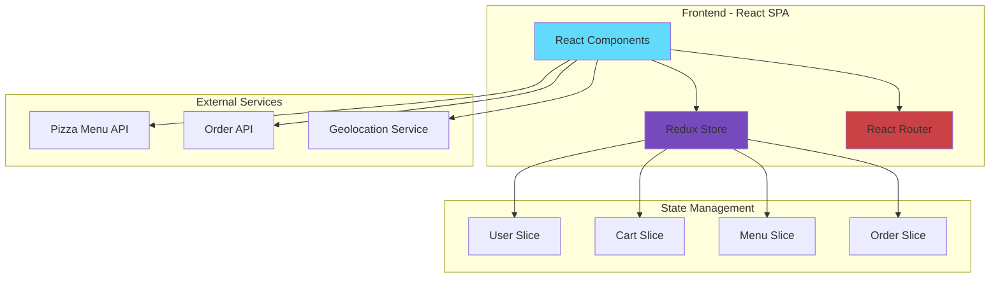
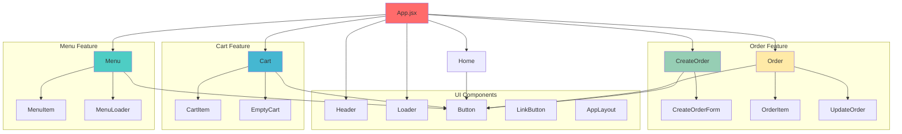
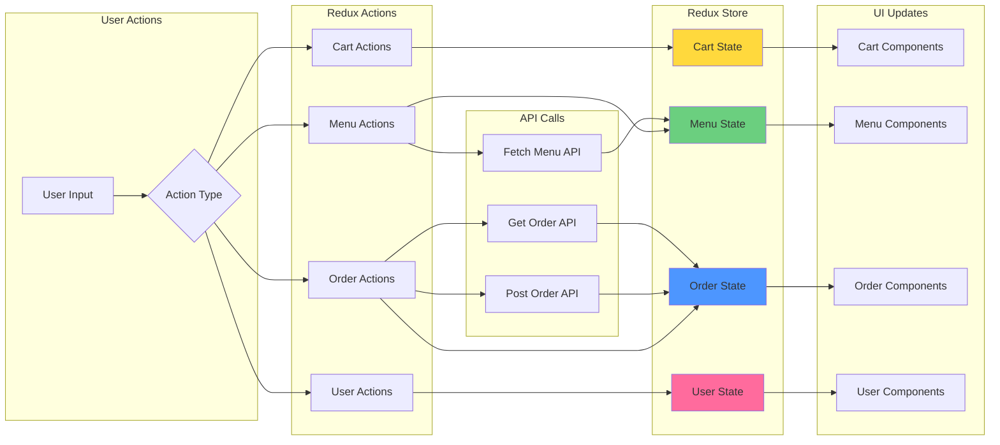
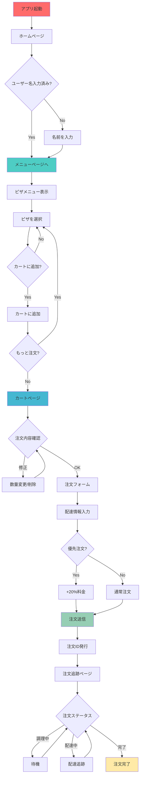

# Fast React Pizza Co. 🍕

Fast React Pizza Co.は、認証不要でピザを注文できるReduxプロジェクトです。シンプルで使いやすいプラットフォームとして設計されており、ユーザーが迅速かつ簡単にピザを注文できるアプリケーションです。

## 🚀 プロジェクトの特徴

### 主要機能
- **認証不要**: アカウント作成やログイン不要。ユーザーは名前を入力するだけでアプリを使用開始
- **動的メニュー**: ピザメニューは変更される可能性があるため、APIから読み込み
- **ショッピングカート**: 注文前に複数のピザをカートに追加可能
- **優先注文オプション**: カート価格の20%追加で「優先」注文をマーク可能
- **位置情報サービス**: 配達を簡単にするためのGPS位置情報提供
- **注文追跡**: 各注文に一意のIDが付与され、後で注文を検索可能

### ユーザー体験の特徴
- 複数ページ、動的メニュー、効率的なカートシステム、スムーズな注文プロセス
- 動的バスケットシステムで、ユーザーはお気に入りのピザを追加し、数量を調整し、自動価格計算を楽しめる
- 位置情報と配達追跡機能

## 🛠 技術スタック

### フロントエンド技術
このプロジェクトは以下の技術を使用して構築されています：

| 技術 | 目的 |
|------|------|
| **React** | UIフレームワークとコンポーネントシステム |
| **Redux** | 状態管理とデータフロー |
| **React Router** | クライアントサイドルーティングとナビゲーション |
| **Tailwind CSS** | ユーティリティファーストCSSフレームワーク |

### アプリケーションアーキテクチャ

#### システムアーキテクチャ図



## 🏗 コンポーネント構造図



## 📊 データフロー図



## 📱 アプリケーションフロー

### ユーザージャーニー フローチャート


- アカウント作成不要
- 名前の入力のみで開始

### 注文処理の詳細フロー

#### 1. ユーザー登録
- アカウント作成不要
- 名前の入力のみで開始

#### 2. メニュー閲覧
- APIから動的に読み込まれるピザメニュー
- リアルタイムでの価格・在庫情報更新

#### 3. 注文プロセス
注文には以下の情報のみ必要：
- ユーザー名
- 電話番号
- 住所
- GPS位置情報（可能な場合）

### 4. 支払いシステム
支払いは配達時に行われるため、アプリ内での決済処理は不要

### 5. 注文管理
- APIへのPOSTリクエストで注文データ（ユーザーデータ + 選択されたピザ）を送信
- 一意の注文IDの発行
- 注文後でも「優先」注文へのアップグレード可能

## 🔧 セットアップと実行

### 必要条件
- Node.js
- npm または yarn

### インストール手順

プロジェクトを開始するには、GitHubリポジトリからファイルをダウンロードし、以下のコマンドを実行：

```bash
# 依存関係のインストール
npm i

# 開発サーバーの起動
npm run dev
```

## 🎯 プロジェクトの目標

このアプリケーションは、実際のピザ注文ウェブサイトをシミュレートするReactベースのプロジェクトとして設計されており、以下の点に重点を置いています：

- **シンプリシティ**: 複雑な認証システムを排除した直感的なUX
- **効率性**: 迅速な注文プロセスと自動化された価格計算
- **柔軟性**: 注文後の優先度変更とリアルタイム追跡
- **実用性**: GPS連携による配達の最適化

このプロジェクトは、現代的なReact開発のベストプラクティスを実証し、実用的なeコマースアプリケーションの構築方法を学習する優れたサンプルとなっています。
